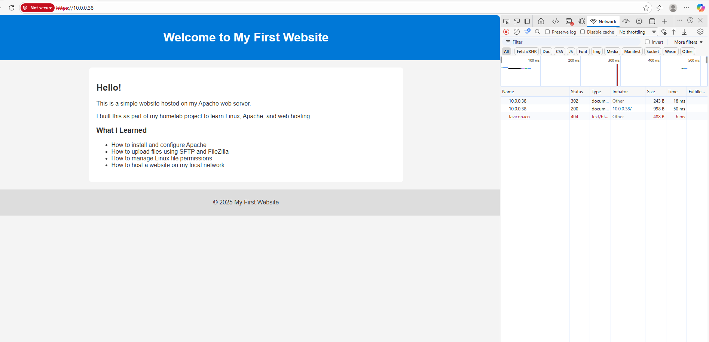

# Apache HTTPS Homelab Project

This project documents my hands‑on homelab setup where I deployed a basic website using Apache, enabled HTTPS with a self‑signed certificate, and managed files between a Linux VM and my Windows host system. The goal of this project is to demonstrate practical skills in Linux administration, web server configuration, SSL/TLS, and Git/GitHub workflow.

---

## 🚀 Project Overview

This homelab project includes:

- Installing and configuring Apache Web Server on Ubuntu  
- Creating and deploying a custom `index.html` webpage  
- Generating and enabling a self‑signed SSL certificate  
- Configuring Apache for HTTPS  
- Managing file permissions and ownership  
- Transferring files between Linux and Windows using SFTP  
- Publishing the project to GitHub for documentation and portfolio use  

---

## 🛠️ Technologies Used

- Ubuntu Linux  
- Apache2 Web Server  
- OpenSSL (self‑signed certificate)  
- SFTP / FileZilla  
- Git & GitHub  
- Windows 10/11 (host system)  

---

## 📂 Project Structure

```
apache-https-homelab/
│
├── index.html
├── configs/
│   ├── 000-default.conf
│   └── default-ssl.conf
├── screenshots/
│   └── *.png
└── README.md
```

---

## 📸 Screenshots

### ✅ Apache Webpage Loaded Over HTTPS


This shows the webpage hosted on Apache, accessed via `https://10.0.0.38`, with a self-signed certificate triggering the browser warning.

---

### 🧠 Learning Outcomes Displayed on the Page


The webpage includes a summary of what I learned during the homelab project:

- Apache installation and configuration  
- SFTP file transfer with FileZilla  
- Linux file permissions  
- Hosting a site on a local network  

---

## 🔐 HTTPS Configuration Summary

I generated a self‑signed SSL certificate using:

```bash
sudo openssl req -x509 -nodes -days 365 \
  -newkey rsa:2048 \
  -keyout /etc/ssl/private/apache-selfsigned.key \
  -out /etc/ssl/certs/apache-selfsigned.crt

sudo a2enmod ssl
sudo a2ensite default-ssl.conf
sudo systemctl reload apache2
---
## 🧩 Conclusion

This homelab project strengthened my understanding of Linux system administration, secure web hosting, and cross‑platform workflows. It also helped me practice documenting technical work clearly for others to follow. This setup forms the foundation for more advanced projects involving automation, reverse proxies, and full-stack deployments.
---
“How to Reproduce This Setup” section
Even a simple 4‑step outline makes your project more professional:
1. 	Install Apache
2. 	Deploy the webpage
3. 	Generate SSL certificate
4. 	Enable HTTPS site

## 🔮 Future Improvements
- Add a proper CA‑signed certificate using Let's Encrypt  
- Configure a reverse proxy with Nginx or Apache  
- Deploy a second site using virtual hosts  
- Automate certificate renewal with a script  
